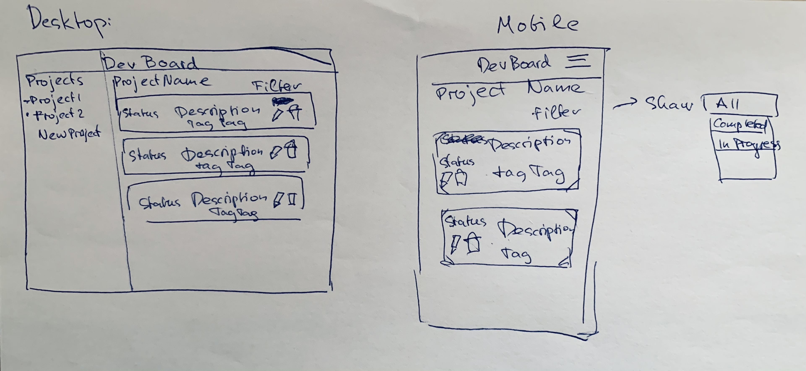

# devBoardApp
A webapp in OOP Javascript + Sass that lets you track and mark your issues and bugs during development.

## Specification (MVP)
- a premade project with an issues list
- users can mark an issue as "done" "in progress" or "review"
- user can edit/update/delete issues
- user can create/view/delete projects
- user can mark issue as "blocker" "dependent" or "independent"

## Learning Goals
- practice OOP + decoupling
- practice single responsibility principle
- learn and implement the basics of SASS and possibly bootstrap
- learn and practice git branching for every small feature
- make the project as extensible as possible

## Project Roadmap
- [x] create wireframe for the MVP 
- [ ] setup webpack for modules and SASS
- [ ] create prototypes with SASS (originally I wanted to go with bootstrap, but later I've found out that you can only customize it with SASS. Since I have to learn SASS at some point anyway, what better time than now?)
- [ ] create a simple todo in console log
- [ ]separate crud into modules
- [ ]separate dom modification from the logic